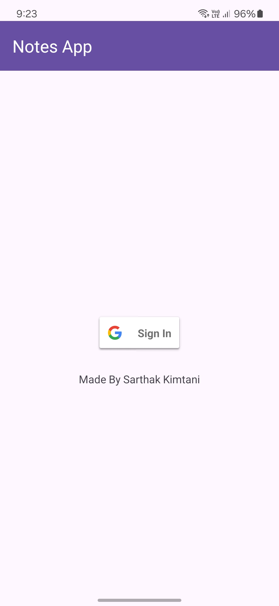
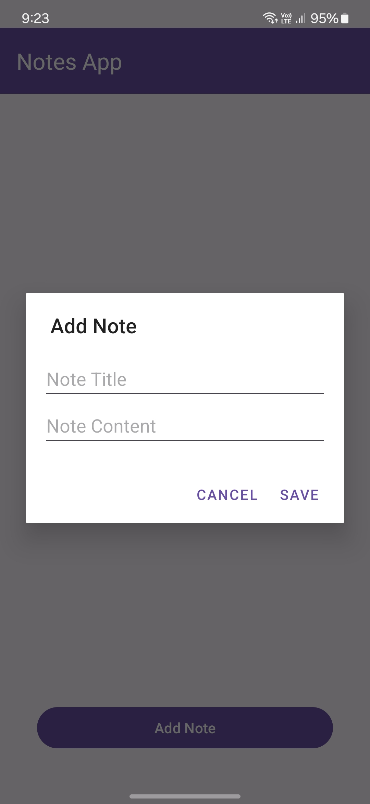
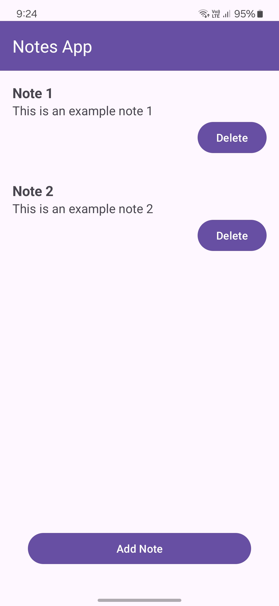

# Notes App

Notes App is a simple Android application for managing personal notes. This project was created as an internship assignment for Internshala.

## Features
- Sign In with Google for authentication
- Display all notes of the logged-in user
- Add new notes
- Update existing notes
- Delete notes

## Screenshots
  

## Getting Started

These instructions will help you set up the project on your local machine for development and testing purposes.

### Prerequisites

- Android Studio
- Android SDK
- A device or emulator running Android 5.0 (Lollipop) or higher

### Installation

1. **Clone the repository:**

   ```bash
   git clone https://github.com/yourusername/NotesApp.git
    ```

2. **Open the project in Android Studio:**

    - Open Android Studio
    - Click on `File` > `Open...`
    - Navigate to the directory where you cloned the repository and open it

3. **Set up Google Sign-In:**

    - Go to the [Google Developers Console](https://console.developers.google.com/)
    - Create a new project or select an existing project
    - Navigate to `Credentials`
    - Create OAuth 2.0 Client IDs and select `Android`
    - Register your app with the SHA-1 certificate fingerprint and package name

4. **Sync the project with Gradle files:**

    - Click on `Sync Project with Gradle Files` in Android Studio or go to `File` > `Sync Project with Gradle Files`

5. **Run the application:**

    - Connect your Android device or start an emulator
    - Click on `Run` > `Run 'app'` or press `Shift + F10`

## License

This project is licensed under the MIT License. See the [LICENSE](LICENSE) file for details.

## Acknowledgments

- This project is part of an internship assignment for Internshala.